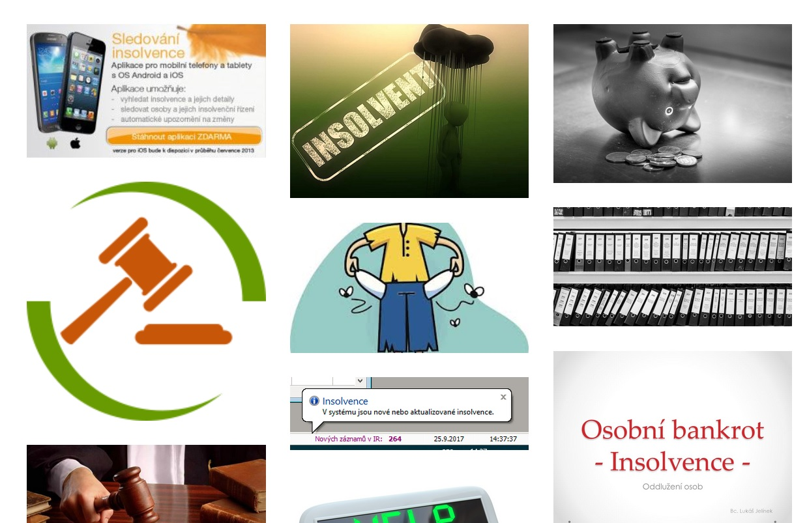

---
title:  "Tvorba moodboard pro náš web" 
date:   2019-04-28 
tags: 
    - KISK
    - start
    - hugo
---

Tvorba moodboardu pro náš web 

V tomto článku bychom rády představily moodboard pro naši stránku. http://www.gomoodboard.com/boards/LNAOihh7/share 
Jelikož naše téma je nazváno Průvodce insolvencí a je koncipováno chronologicky, tak jak insolvenční řízení probíhá, do 10 kapitol
 - viz předposlední odstavec na stránkách
 (https://elegant-visvesvaraya-ecc193.netlify.com/about/?fbclid=IwAR1mUToo1ZNndU4zX6mhzwJm2HMHto-2mUitS7w7VIZGELj_svMHpUStSKg) 
 mám v koncepci stránek poměrně jasno. Po přihlášení uvidí klient úvodní stránku, kde bude uvedeno k členu stránky slouží,
 na levé straně budou přepínače na jednotlivé kapitoly v následující struktuře: 
 <ol>
 <li> vysvětlení pojmu úpadek  a další základní pojmy insolvenčního zákona </li>
 <li> smysl oddlužení a rozdíl mezi oddlužením a konkurzem </li>
 <li> fáze oddlužení obecně </li>
 <li> insolvenční návrh </li>
 <li> účastnící řízení </li>
 <li> povolení oddlužení </li>
 <li> přezkumné jednání </li>
 <li> schválení oddlužení </li>
 <li> úkony v průběhu oddlužení </li>
 <li> ukončení oddlužení </li>
 <li> důležité odkazy. </li>
</ol>

 Po kliknutí na odkaz se otevře konkrétní kapitola, kde bude pojem dopodrobna a pokud možno pro laika srozumitelně vysvětlený. 
 Každá kapitola bude doplněna obrázky a další grafikou. 
 Obrázky by měli být jak vtipné, pro odlehčení tématu, tak odborné, pro vysvětlení a pochopení problematiky. 
 Jelikož veškeré texty budou odbornou součástí jednotlivých kapitol, nepovažuji za nutné vkládat do moodboardu.
V něm uvádím pouze obrázky, z nichž některé bych ráda použila v jednotlivých kapitolách.

Ježto nikdo z nás není profesionální právník, elf předpokládá, že naše stránka bude fungovat jako jakýsi rozcestník. Bude obsahovat nejdůležitější terminologické definice základních pojmů souvisejících s ústředním tématem, odkazy na dokumenty a služby, které mohou pomoci, a možná i varování před nejčastějšími chybnými kroky - kam nechodit, co nedělat a před čím se mít na pozoru.
Jako taková bude stránka hodně textová, což usnadní situaci i ohledně autorských práv u ilustrací.

http://www.gomoodboard.com/boards/O8fzEua1/share
 
